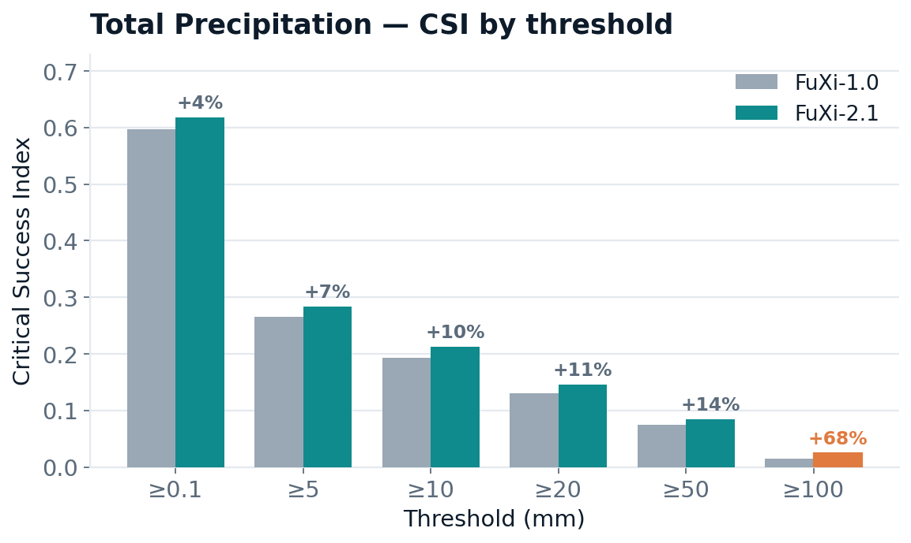
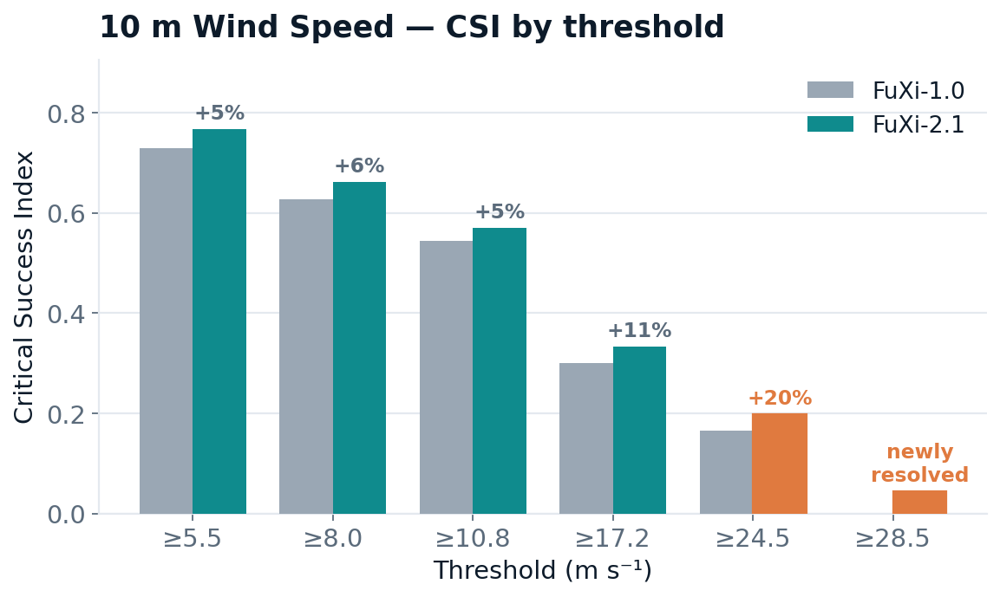

# FuXi 2.1 — Global Weather Forecasting Model

**FuXi-2.1** is a global, deterministic machine-learning weather forecasting model
developed by **Fudan University** and **[SAIS](https://www.sais.com.cn/)**. It produces
85-channel forecasts at **0.25°** resolution, in **6-hourly** steps, out to **10 days**.

FuXi-2.1 targets a defining failure mode of data-driven weather prediction: forecasts
that blur toward a smooth spatial average as lead time grows, erasing the small-scale
structure that matters most for extremes. It produces markedly sharper fields whose
spatial power spectra track observations across the full wavenumber range, while keeping
deterministic skill (RMSE) comparable to FuXi-1.0 and substantially improving
extreme-event detection for heavy precipitation and strong wind.

This model is part of the
**[FuXi Single collection](https://huggingface.co/collections/tpys/fuxi-single)**.
This repository provides the exported model and minimal inference code for
autoregressive rollout using the PyTorch PT2 (`torch.export`) backend.

## What's New in 2.1

Relative to [FuXi-1.0](https://github.com/tpys/FuXi), FuXi-2.1 introduces:

- **A flat Transformer backbone** replacing FuXi-1.0's U-Transformer
  (ResNet downsample → Swin Transformer → upsample). FuXi-2.1 removes the U-shaped
  up/down-sampling path in favor of a single Transformer trunk.
- **Rotary position embeddings (RoPE)** inside Swin windowed attention, replacing the
  learned relative-position bias used in FuXi-1.0.
- **adaLN time conditioning** that injects forecast lead step, time of day, and
  day-of-year phase into every block.
- **A variable-aware multi-head decoder** with specialized output heads for
  pressure-level, surface, and derived variables.

The combined effect is sharper, spectrally faithful forecasts without a penalty on
mean-error skill.

## Quick Start

```bash
# Install dependencies
pip install -r requirements.txt

# Run end-to-end (inference + plots)
bash run.sh --model_dir /path/to/model --input /path/to/input.nc --steps 5 --forecast_time 2024092900

# Or run directly:
python inference.py \
    --model_dir /path/to/model \
    --input /path/to/input.nc \
    --output_dir ./output \
    --steps 40 \
    --forecast_time 2024092900

# Plot results
python plot.py --output_dir ./output --channels t2m z500 tp --discrete
```

## Model Details

| Property | Value |
|----------|-------|
| Resolution | 0.25° (721 × 1440 grid) |
| Channels | 85 (65 pressure-level + 20 surface) |
| Time step | 6 hours |
| Input frames | 2 (t-6h, t) |
| Forecast type | Global, deterministic, autoregressive |
| Architecture | Patch embedding → Swin attention with RoPE + adaLN → multi-head decoder |
| Format | `torch.export` (`.pt2`) |
| Size | ~3.7 GB |

### Architecture

FuXi-2.1 is a single Transformer. The global atmospheric state is split into patches and
embedded into tokens, processed by a stack of windowed-attention blocks, and read out by
a variable-aware multi-head decoder. One deterministic forward pass predicts the next
6-hour state; predictions are then rolled out autoregressively.

<div align="center">
  
</div>

| Component | Specification |
|---|---|
| Backbone | Single Transformer trunk (no U-Net up/down-sampling) |
| Attention | Swin windowed attention |
| Position encoding | Rotary position embedding (RoPE, 1-D) |
| Normalization / conditioning | adaLN conditioned on lead step, time of day, and day of year |
| Feed-forward network | SwiGLU |
| Decoder | Variable-aware multi-head (pressure-level / surface / derived) |
| Input | Two states at t−6 h and t |
| Output | State at t+6 h, rolled out autoregressively |

## Input Format

The input NetCDF file must contain a variable named `input` with:

- **Shape**: `(time=2, channel=85, lat=721, lon=1440)`
- **Normalization**: z-score normalized (already in normalized space)
- **Coordinates**: `time`, `channel` (C85 names), `lat` (90 to -90), `lon` (0 to 359.75)

The provided `input.nc` is a sample input for 2024-09-29 00Z. Both `input.nc` and the model's internal weights operate in normalized space.

## Output Format

Each forecast step is saved as `{output_dir}/{step:03d}.nc`:

- **Shape**: `(channel=85, lat=721, lon=1440)`
- **Units**: Physical units (denormalized via `output = output * std + mean`)
- **Coordinates**: `channel`, `lat`, `lon`
- **Attribute**: `valid_time` — the forecast valid time for this step

Step numbering is 1-based: `001.nc` = +6h, `002.nc` = +12h, ..., `040.nc` = +240h (10 days).

> **Note:** The `tp` (total precipitation) channel is log1p-transformed during training. Denormalization reverses this with `expm1` and clips to ≥ 0.

## Data Details

### Training Data

FuXi-2.1 was trained on ERA5 reanalysis at 0.25° resolution and a 6-hour cadence.

- **Training period:** 2002–2023
- **Held-out test period:** 2024

### Channel Table (C85)

FuXi-2.1 operates on 85 channels per time step: 65 pressure-level channels
(5 variables × 13 levels) and 20 surface channels, plus static forcings supplied as
constant inputs. Most channels are **prognostic**: they are both input and output
channels and are fed back during rollout. Radiation fluxes and total precipitation are
**diagnostic** outputs from a dedicated decoder head. Their channels remain present in
the recurrent input to preserve the fixed 85-channel layout, but their values are zeroed
before feedback so accumulated diagnostic fields are not propagated to the next step.

**Pressure-level variables** (5 vars × 13 levels = 65 channels):

- z (geopotential), t (temperature), u (u-wind), v (v-wind), q (specific humidity, **g/kg** — scaled ×1000 from ERA5's kg/kg)
- Levels: 50, 100, 150, 200, 250, 300, 400, 500, 600, 700, 850, 925, 1000 hPa

**Surface variables** (20 channels):

| Channel | Variable | Units |
|---------|----------|-------|
| msl | Mean sea level pressure | Pa |
| t2m | 2m temperature | K |
| d2m | 2m dewpoint temperature | K |
| sst | Sea surface temperature | K |
| ws10m | 10m wind speed | m/s |
| ws100m | 100m wind speed | m/s |
| u10m / v10m | 10m wind components | m/s |
| u100m / v100m | 100m wind components | m/s |
| lcc / mcc / hcc / tcc | Cloud cover | 0-1 |
| ssr / ssrd / fdir / ttr | Radiation fluxes | J/m² |
| tcw | Total column water | kg/m² |
| tp | Total precipitation | m (log1p-transformed, reversed on output) |

See `variables.py` for the full ordered list.

**Static forcings** include the land-sea mask, orography/geopotential,
latitude/longitude encodings, and time-of-day/day-of-year encodings.

## GPU Requirements

- **Minimum GPU memory**: ~8 GB (model ~4 GB + state ~1.4 GB + working memory)
- The model device is baked into the exported graph. It must be loaded on a CUDA device.

## File Structure

```
fuxi-2.1/
├── fuxi-2.1.pt2         # Model weights (torch.export)
├── mean.nc              # Channel means for denormalization
├── std.nc               # Channel stds for denormalization
├── input.nc             # Sample input (pre-normalized)
├── inference.py         # Rollout engine
├── data_util.py         # Data loading + postprocessing
├── variables.py         # C85 channel definitions
├── plot.py              # Visualization (uses fuxi_viz)
├── run.sh               # End-to-end demo
├── requirements.txt     # Python dependencies
├── infer_log.txt        # Sample inference log (H100, PyTorch 2.11.0, CUDA 12.8)
└── README.md            # This file
```

## How It Works

1. **Load** pre-normalized input (2 frames at t-6h and t)
2. **Rollout** autoregressively: model outputs next 2-frame state, last frame is the prediction
3. **Prepare recurrence**: retain the prediction for output, then zero radiation-flux and
   precipitation channels in the recurrent state before the next step
4. **Denormalize** each prediction: `output = output * std + mean`, then `expm1` for precipitation
5. **Save** each step as NetCDF with geographic coordinates

The recurrence state stays on GPU throughout the rollout (no CPU round-trip per step).

### Note on Specific Humidity (q)

The specific humidity `q` is stored and predicted in **g/kg** (grams of water vapor per kg of dry air), not the raw ERA5 kg/kg. During data preparation, ERA5 q values were multiplied by 1000 before normalization.

## Evaluation

We compare FuXi-2.1 with FuXi-1.0 under an identical protocol: forecasts initialized
from ERA5 and rolled out to 240 hours in 6-hour steps. CSI is computed globally over
land only.

> **Evaluation scope:** These values come from a limited set of sample cases rather than
> a full-year evaluation. Treat them as indicative; broader scorecards will follow.

RMSE remains comparable to FuXi-1.0 across variables, while structural and
extreme-event scores improve substantially.

<div align="center">
  
  
</div>

### Precipitation — Critical Success Index (CSI)

| Threshold | FuXi-1.0 | FuXi-2.1 | Δ |
|:---|---:|---:|---:|
| ≥ 5 mm | 0.265 | 0.284 | +7.3% |
| ≥ 20 mm | 0.131 | 0.146 | +11.4% |
| ≥ 50 mm | 0.074 | 0.084 | +13.4% |
| ≥ 100 mm | 0.014 | 0.024 | **+68.3%** |

### 10 m Wind Speed — Critical Success Index (CSI)

| Threshold | FuXi-1.0 | FuXi-2.1 | Δ |
|:---|---:|---:|---:|
| ≥ 10.8 m·s⁻¹ | 0.544 | 0.571 | +4.8% |
| ≥ 24.5 m·s⁻¹ | 0.165 | 0.198 | +20.3% |
| ≥ 28.5 m·s⁻¹ | 0.000 | 0.044 | newly resolved |

The relative gain grows with event intensity and peaks at the extreme tail. At the
28.5 m·s⁻¹ wind threshold, FuXi-1.0 scores zero whereas FuXi-2.1 attains a non-zero CSI.
FuXi-2.1's spatial power spectra track the observed spectra across the full wavenumber
range, in contrast with FuXi-1.0's high-wavenumber energy deficit.

## Known Limitations

- FuXi-2.1 is deterministic and does not provide a calibrated ensemble spread.
- The CSI results above cover a limited set of sample cases and are not a full-year
  scorecard.
- As with all ERA5-trained models, forecast skill depends on the quality and resolution
  of the initial conditions.

## Citation

If you use FuXi-2.1, please cite the FuXi series:

- **FuXi Cascade:** [FuXi: A cascade machine learning forecasting system for 15-day global weather forecast](https://arxiv.org/abs/2306.12873)
- **FuXi-Energy:** [FuXi-2.0: Advancing machine learning weather forecasting model for practical applications](https://arxiv.org/abs/2409.07188)

```bibtex
@article{chen2023fuxi,
  title   = {FuXi: A cascade machine learning forecasting system for 15-day global weather forecast},
  author  = {Chen, Lei and Zhong, Xiaohui and Zhang, Feng and Cheng, Yuan and Xu, Yinghui and Qi, Yuan and Li, Hao},
  journal = {npj Climate and Atmospheric Science},
  year    = {2023},
  volume  = {6},
  pages   = {190},
  doi     = {10.1038/s41612-023-00512-1}
}
```

## License

FuXi-2.1 is released under the
[Creative Commons Attribution 4.0 International license](https://creativecommons.org/licenses/by/4.0/).

**Code:** FuXi-1.0 — https://github.com/tpys/FuXi

*© 2026 Fudan University & [SAIS](https://www.sais.com.cn/) · FuXi Weather.*
